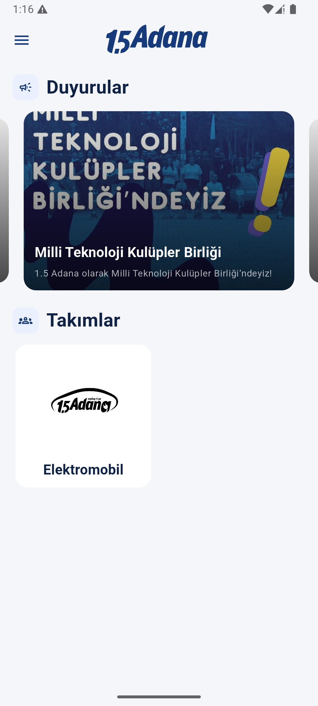
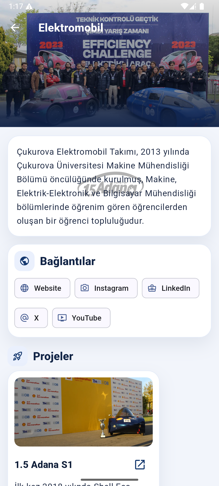
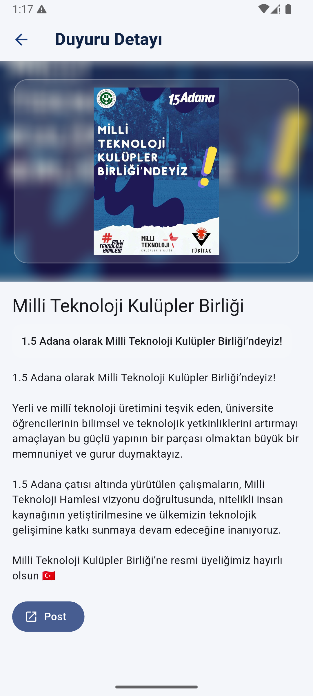
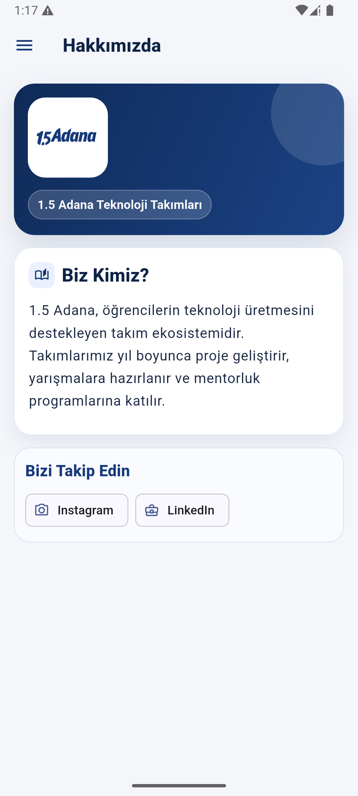

# 1.5 Adana Teknoloji Takimlari Mobil Uygulamasi

  

Firebase tabanli, icerigi admin panelden yonetilen, tamamen dinamik bir takim tanitim ve duyuru mobil uygulamasi.

## Google Play

- Uygulama linki: https://play.google.com/store/apps/details?id=com.birbucukadana

## Ekran Goruntuleri

Asagidaki alanlar README icinde hazirlandi. Goruntuleri bu yollara ekleyince otomatik gosterilecektir:

- `assets/screenshots/home.png`
- `assets/screenshots/team-detail.png`
- `assets/screenshots/ancoument-detail.png`
- `assets/screenshots/about.png`

| Ana Sayfa | Takım Detay |
|---|---|
|  |  |

| Duyuru Detay | Hakkımızda |
|---|---|
|  |  |

## Uygulama Ozeti

- Hedef: 1.5 Adana ekosistemindeki takimlari, etkinlikleri, odulleri ve duyurulari tek uygulamada toplamak.
- Icerik modeli: Kod degistirmeden Firestore uzerinden veri guncelleme.
- Platform: Flutter (Android, iOS, Web, Desktop altyapisi proje icinde mevcut).

## Canli Ozellikler (Neler Var)

- Drawer menu: Anasayfa, Hakkimizda, Etkinlikler, Yarismalar, Sponsorlar, Oduller, Iletisim
- Anasayfada duyuru carousel yapisi ve detay sayfasi
- Takim grid listeleme ve zengin takim detay sayfasi
- Takim detayinda sosyal medya, projeler, oduller, sponsorlar
- Etkinlik listeleme (takim/genel etiketi + tarih siralama)
- Yarismalar ve performans alanlari
- Oduller listesi ve odul detay ekrani
- Onemli duyuru popup akisi ve "Bir Daha Gosterme" destegi
- Bos sosyal medya alanlarini otomatik gizleme
- Acilista preload/warmup ile daha dengeli ilk acilis deneyimi

## Planlananlar (Neler Yok / Gelistirilebilir)

- Uygulama ici gelismis arama ve filtreleme
- Favori takim/etkinlik kaydetme
- Push notification segmentasyonu
- Offline cache katmaninin daha ileri seviyeye alinmasi
- E2E test kapsami ve CI pipeline iyilestirmeleri

## Tema ve Tasarim Dili

Tema Flutter tarafinda merkezi olarak `lib/core/app_theme.dart` dosyasindan yonetilir.

- Seed renk: `#173A7A`
- Baslik ana ton: `#102345`
- Govde metin tonu: `#1E355F`
- Arka plan: `#F4F6FA`
- Vurgu acik mavi tonlari: `#EAF0FD`

Bu palet, kurumsal mavi eksende temiz ve okunabilir bir arayuz icin secilmistir.

## Mimari ve Veri Akisi

- Uygulama girisi: `main.dart`
- Uygulama kabugu: `lib/screens/root_shell.dart`
- Tema: `lib/core/app_theme.dart`
- Veri katmani: `lib/services/content_service.dart`
- Popup davranisi: `lib/services/popup_service.dart`
- Domain modelleri: `lib/models/*`

### Firestore Koleksiyonlari

Uygulama su koleksiyonlari okuyarak calisir:

- `settings/app`
- `announcements`
- `teams`
- `events`
- `sponsors`
- `competitions`
- `awards`
- `projects`

## Kullanilan Teknolojiler

### Core

- Flutter (SDK 3.6+)
- Dart
- Firebase Core
- Cloud Firestore

### Paketler

- `carousel_slider`
- `cached_network_image`
- `flutter_svg`
- `url_launcher`
- `shared_preferences`
- `intl`
- `uuid`
- `flutter_markdown`

## Gelistirici Kurulumu

1. Flutter kurulumunu dogrulayin:
  - `flutter doctor`
2. Proje klasorune gecin:
  - `cd birbucukadana`
3. Bagimliliklari indirin:
  - `flutter pub get`
4. Firebase dosyalarini yerlestirin:
  - Android: `android/app/google-services.json`
  - iOS: `ios/Runner/GoogleService-Info.plist`
5. Uygulamayi calistirin:
  - `flutter run`

## Build Komutlari

- Debug APK: `flutter build apk --debug`
- Release APK: `flutter build apk --release`
- Release AAB: `flutter build appbundle --release`

## Guvenlik ve Yayin Notlari

- Uretim ortaminda Firestore kurallari sikilastirilmalidir.
- Imzalama bilgileri ve gizli anahtarlar repoda tutulmamalidir.
- Uretimde `.jks`, sifre ve servis hesap bilgileri CI secret veya guvenli ortamlarda yonetilmelidir.

## Diger Gelistiriciler Icin Hizli Notlar

- Admin panel klasoru: `../admin-panel`
- Mobilde tum icerik Firestore'dan canli okunur; schema degisikliklerinde modeller kontrol edilmelidir.
- Yeni alan eklerken once model (`lib/models`) sonra ekran (`lib/screens`) guncellenmelidir.
- `flutter analyze` temiz cikmadan PR acilmamasi onerilir.

## Proje Sahibi ve Iletisim

- Gelistirici: Tuncay (GitHub: `tnc4y`)
- Repo: `tnc4y/birbucukadanaadmin`
- Iletisim: E-posta/website bilgisi eklenebilir.

## Lisans

Bu proje su anda ozel kullanim odaklidir. Acik kaynak lisans eklenecekse bu bolum MIT/Apache-2.0 vb. ile guncellenmelidir.
